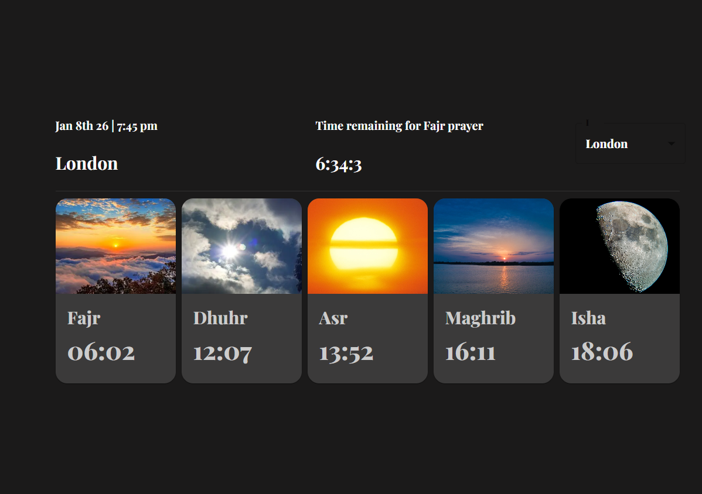

# ⏰ Prayer Times App

Prayer Times App is a modern **prayer times application** that displays daily prayer times based on the selected city, along with the city’s local time and a real-time countdown to the next prayer.

The application provides a clean and user-friendly interface, allowing users to easily switch between cities and view accurate time-based information.

---

## 🚀 Features

- City-based prayer times fetched from the Aladhan API  
- Display of the selected city’s **local time**  
- Real-time countdown to the next scheduled prayer time  
- City selection support  
- Clean and responsive user interface  
- Organized and maintainable project structure  

---

## ⚙️ Technologies & Tools

- React.js  
- React Hooks (useState, useEffect, useMemo)  
- Material UI (MUI)  
- Axios  
- Moment.js & Moment-Timezone  
- Aladhan API  
- HTML, CSS, JavaScript  

---

## ⏰ Time & Timezone Handling

The application dynamically adjusts the displayed time according to the **selected city’s local timezone** using `moment-timezone`, ensuring accurate time representation across different regions.

---

## 🧠 Purpose

This project was developed to practice:
- API integration  
- Timezone and time calculations  
- Real-time updates in React  
- Building clean and scalable user interfaces  

---

## 📌 Status

The application is fully functional and can be extended with additional features such as:
- Additional cities and regions  
- Notifications and reminders  
- UI theme customization  
- Mobile optimizations  

---

## ⚙️ Design overview

